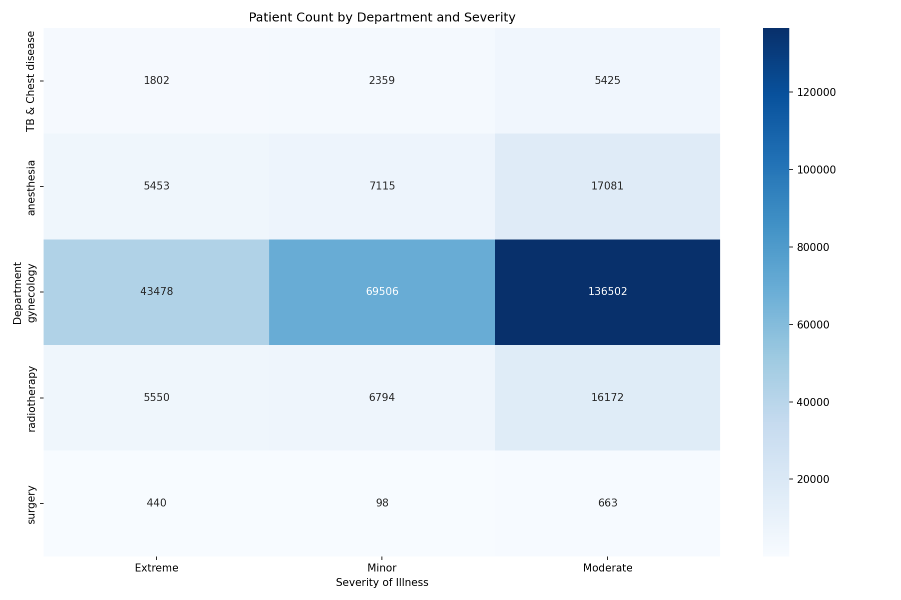
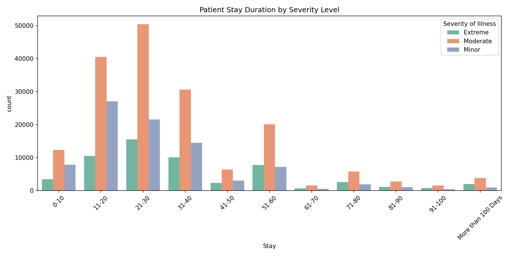
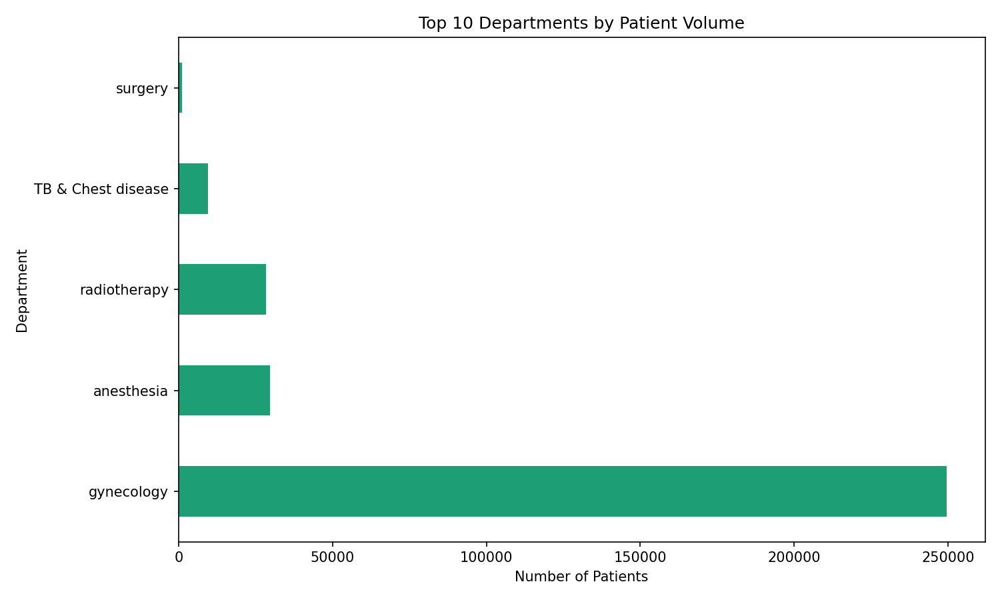

# Healthcare Patient Analytics Dashboard

## About this project
Full end-to-end data analytics project analyzing 318,438 
real hospital patient records to identify department 
workload, severity patterns, and admission trends.

## Tools used
- Python · pandas · seaborn · matplotlib
- SQL · SQLite
- Power BI — interactive dashboard

## Business questions answered
- Which departments handle the most patients?
- How does severity affect length of stay?
- What are the most common admission types?
- Which departments have highest admission deposits?

## Key findings
- Gynecology handles 78% of all patient admissions
- Moderate severity patients form 55% of all cases
- Trauma admissions are the most common type
- Average admission deposit is 4.88K

## Project structure
- notebooks/ — Python analysis
- charts/ — visualizations
- dashboard/ — Power BI files
- sql/ — SQL queries
- data/ — clean dataset

## Charts

## Dashboard Preview

---
*Project by Hamna Maqbool — Data Analyst Portfolio*
*Targeting remote data analyst roles in Canada*
